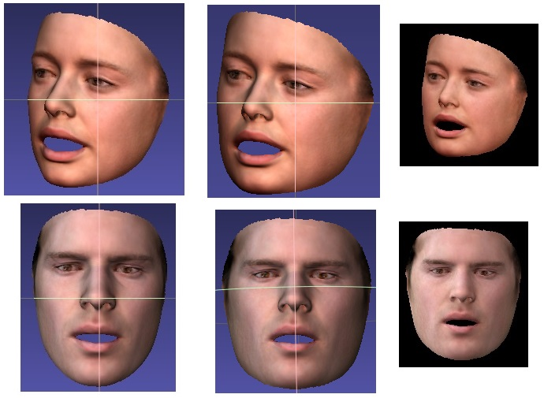

# Introduction

This is my simple framework to accelerate python with C / CUDA. An useful example about 3D object rendering is provided to show how to use it.

**TIPS about framework**
1. It just a framework about invoking a dynamic link library by python .
2. Python‘s cuda variables is pytorch's cuda tensors.
3. It shows convenient mutual accessing between numpy/pytorch and C/CUDA.
4. Avoid calling C functions on python multi-threads. Multi-thread are suggested to be coded in C (c++11, openmp ..) and invoked by python.
5. C code can also includes another c++ libraries like opencv.


**TIPS about rendering**
1. Supporting batch rendering.
2. I don't provide the example about neural network back propagation.
Actually, if you want to autodiff by pytorch, the rendering code can't be write as this. You can use my framework to compute rendering informations quickly, and then render images only by pytorch operations.


# Requirements
CUDA

pytorch

# Demo
To run my code, you must got to dir `chj_speed_cdll` to compile a dynamic link library first. It is only related with cuda, not related with python, numpy or pytorch. So if your are familiar with C++, it will be very easy.

On Linux

```
cd chj_speed_cdll
mkdir _build
cd _build
cmake ..
make -j4
```

On Windows

Just use Cmake-gui


## 1.mesh_render.py
Just see the function `f1()`, you will know how to use it.

Here is the results:



Meshlab has added its own lighting and use perspective projection as default. For this rendering, I assume your 3D obj has done perspective projection (z use its original) or orthogonal projection.

**Speed**

(On GTX1060 3G) Rendering two 224*224 images takes about 1ms. 

Rough measurements. (Include rendering and gpu->cpu time)

| batch size | times (ms) |
|--------|--------|
| 2 | 1 |
|  16      |   4.2     |
|  64      |   16     |
|  128      |   35     |


# Future Work

1. The rendering code is not perfect and really simple. You may need to correct or modify it according to your tasks.

# Postscript

This code was originally opened for a person for his fast rendering purpose. Meanwhile, he helped me optimize the readme file and name this repo.
